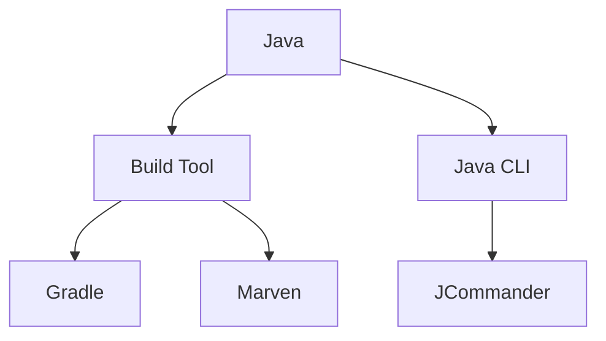

## Notes:

![[20221007211644 ~ Java Roadmap.png]]

![[2022-10-07 21.24.51 java roadmap.excalidraw]]

- [ ] Java CLI 🔽 
- [ ] [[JCommander]]  🔽 

## Source:
- https://github.com/s4kibs4mi/java-developer-roadmap
