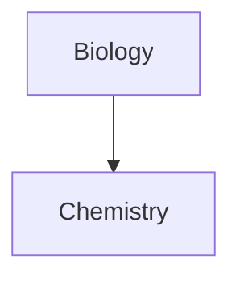
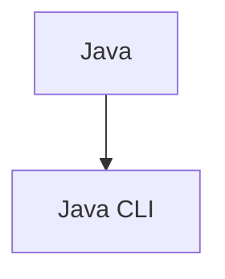

## Notes:

```mermaid
graph TD
Biology --> Chemistry
```

```mermaid
graph TD
Biology --> Chemistry
class Biology,Chemistry internal-link;
```

```mermaid
graph TD
A[Java]
B[Java CLI]
A --> B
class A,B internal-link;
```
## Source
https://help.obsidian.md/How+to/Format+your+notes
https://mermaid-js.github.io/mermaid/#/