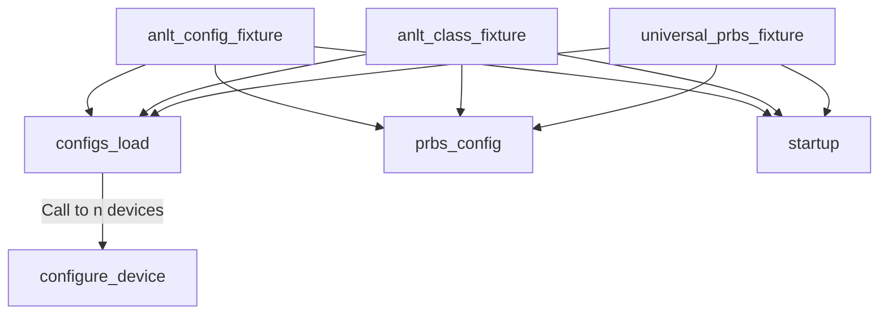

prbs fixture

|     |                        |                     |                              |
| --- | ---------------------- | ------------------- | ---------------------------- |
| 1   | universal_prbs_fixture | capella_fixtures.py |                              |
| 2   | configs_load           | common_fixtures.py  | then config CTCB and LYNX400 |
| 3   | configure_device       |                     |                              |
|     |                        |                     |                              |

`tests/universal/test_universal_prbs.py::TestPrbsUniversal::test_prbs_universal`

