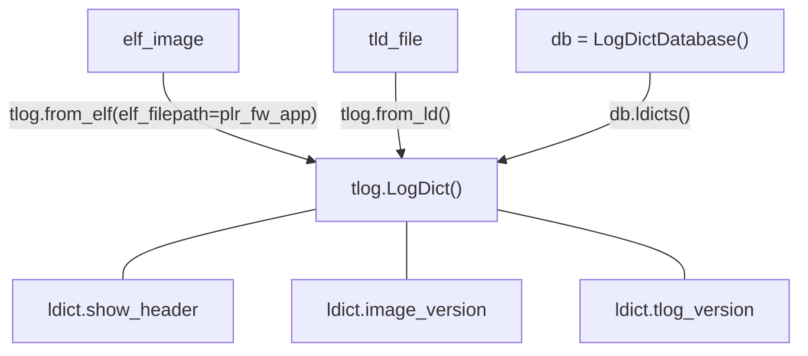

```mermaid
graph TB;
	elf_image --"tlog.from_elf(elf_filepath=plr_fw_app)"--> ldict
	tld_file --"tlog.from_ld()"--> ldict

	db["db = LogDictDatabase()"]
	db -- "db.ldicts()" --> ldict

	ldict["tlog.LogDict()"]
	ldict --- ldict.show_header
	ldict --- ldict.image_version
	ldict --- ldict.tlog_version

```
